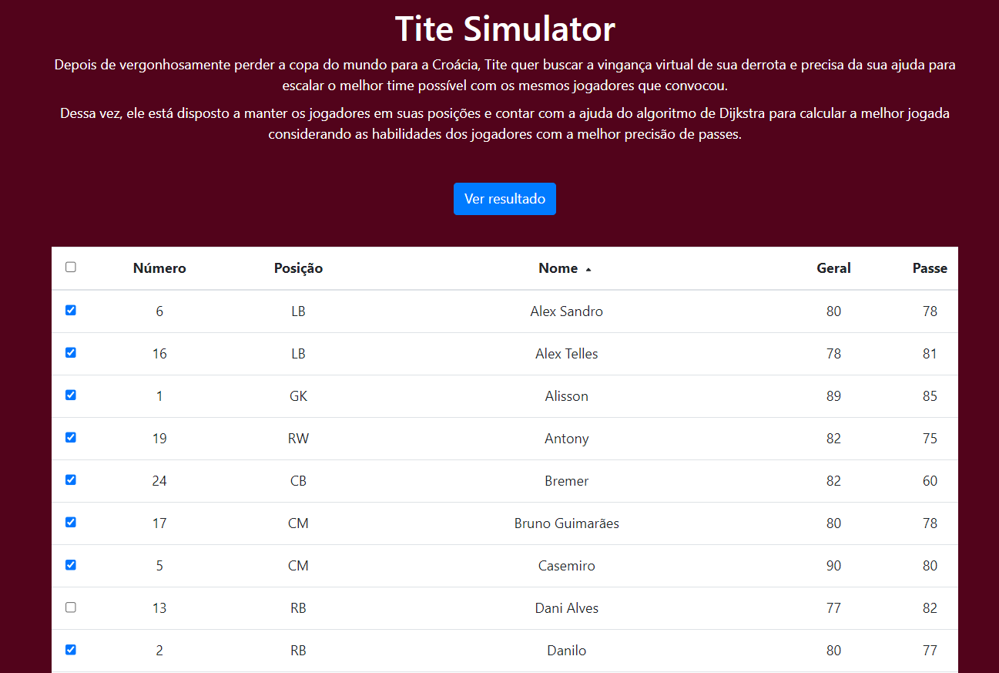
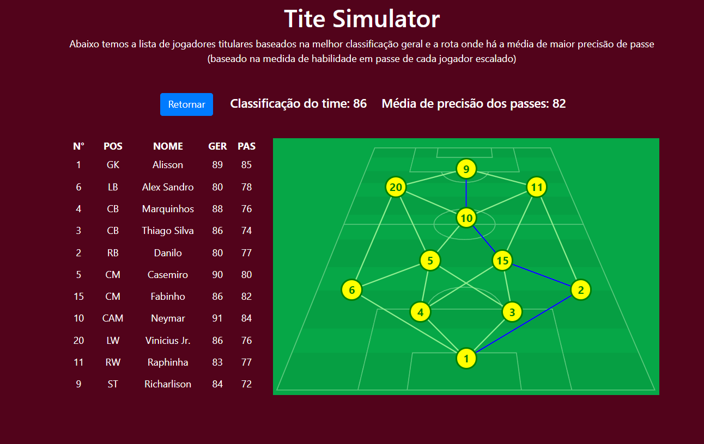
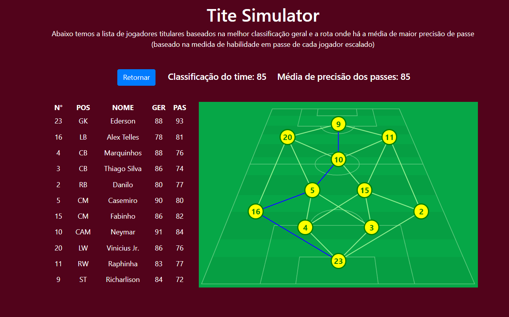

# Final_UltimateTiteSimulator

**Número da Lista**: 16 
**Conteúdo da Disciplina**: Grafos 2 + Programação Dinâmica 

## Alunos
| Matrícula | Aluno                                                       |
| --------- | ----------------------------------------------------------- |
| 180063162 | [Daniel Primo](https://github.com/danieldagerom) |
| 150011903 | [Igor Aragão](https://github.com/roginaldosemog) |

## Sobre 
O objetivo do projeto é utilizar o algoritmo de Dijkstra para mostrar o caminho com a maior média de precisão de passes com a bola saindo do goleiro e chegando ao atacante.

## Screenshots

  

  

  

## Apresentação
O vídeo para apresentação se encontra disponível para baixar [AQUI](assets/presentation.mp4)

## Instalação 
**Linguagem**: Javascript 
**Framework**: React 

Para rodar o projeto instale as dependências descritas no [tutorial oficial do React](https://reactjs.org/tutorial/tutorial.html).

Após a instalação, rode os comandos `yarn install` e em seguida `yarn start`.

## Uso 
Marque os jogadores que deseja manter na lista de convocados e clique em "Ver Resultado".
Também está disponível em [ultimatetitesimulator.netlify.app](https://ultimatetitesimulator.netlify.app/)

